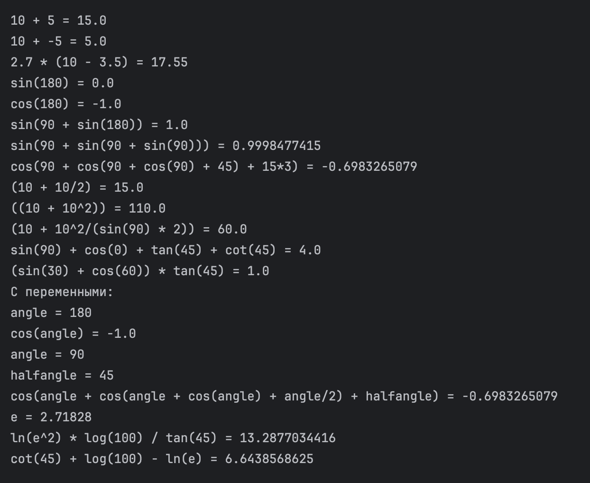

# Вычислитель выражений
Класс вычисляет арифметические выражения из строк. Есть поддержка функций `sin()` и `cos()`, переменных.
Код лежит [здесь](https://github.com/Nikita-bite/secondLabJava/blob/main/src/main/java/org/example/ExpressionEvaluator.java).

## Пример работы
Код примера лежит [здесь](https://github.com/Nikita-bite/secondLabJava/blob/main/src/main/java/org/example/Main.java).

